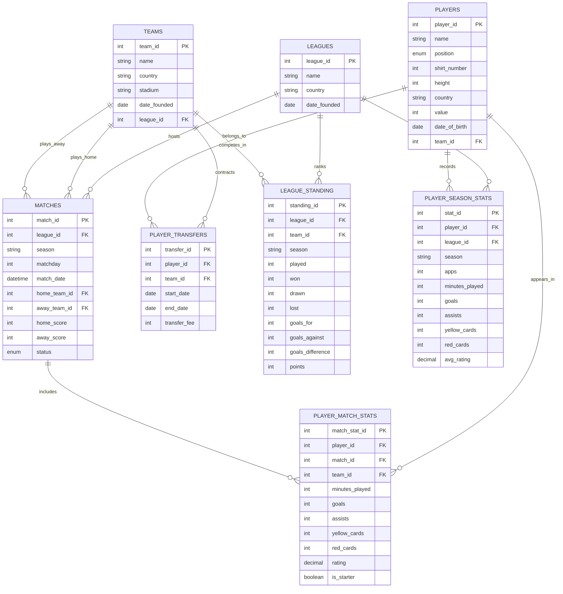

| Method | Path | Description | Auth | Success | Error |
|--------|------|-------------|------|---------|-------|
| POST | `/auth/register` | Create new user account | No | 201 | 400, 409 |
| POST | `/auth/login` | Login to the system | No | 200 | 400, 401 |
| POST | `/teams` | Creates new team | Yes | 201 | 400, 403, 409 |
| POST | `/teams/{id}/players` | Add player to the team | Yes | 201 | 400, 403, 404, 409 |
| POST | `/players/{id}/player_season_stats` | Add player stats | Yes | 201 | 400, 403, 404 |
| GET | `/teams/{id}/players` | Get every player on a team | No | 200 | 404 |
| GET | `/players/{id}/player_season_stats` | Get player stats | No | 200 | 404 |
| GET | `/players?country=France` | Get every France player | No | 200 | 400 |
| GET | `/users` | Get every user in the DB | Yes | 200 | 401, 403 |
| GET | `/users/{id}/followed_teams` | Get a user's followed teams | Yes | 200 | 401, 403, 404 |
| PUT | `/players/{id}/player_season_stats` | Update player stats | Yes | 200 | 400, 403, 404 |
| PUT | `/teams/{team_id}/league` | Changes a team's league | Yes | 200 | 400, 403, 404, 409 |
| PUT | `/teams/{id}` | Update team details | Yes | 200 | 400, 403, 404 |
| PUT | `/players/{id}` | Update player details | Yes | 200 | 400, 403, 404 |
| PUT | `/users/{id}` | Update own user profile | Yes | 200 | 400, 401, 403, 404 |
| DELETE | `/teams/{id}` | Deletes a team | Yes | 204 | 403, 404 |
| DELETE | `/players/{id}` | Deletes a player | Yes | 204 | 403, 404 |
| DELETE | `/teams/{team_id}/players/{player_id}` | Remove player from a team | Yes | 204 | 403, 404 |
| DELETE | `/players/{id}/player_season_stats/{season_id}` | Delete a stats entry | Yes | 204 | 403, 404 |
| DELETE | `/users/{id}/followed_teams/{team_id}` | Unfollow a team | Yes | 204 | 403, 404 |